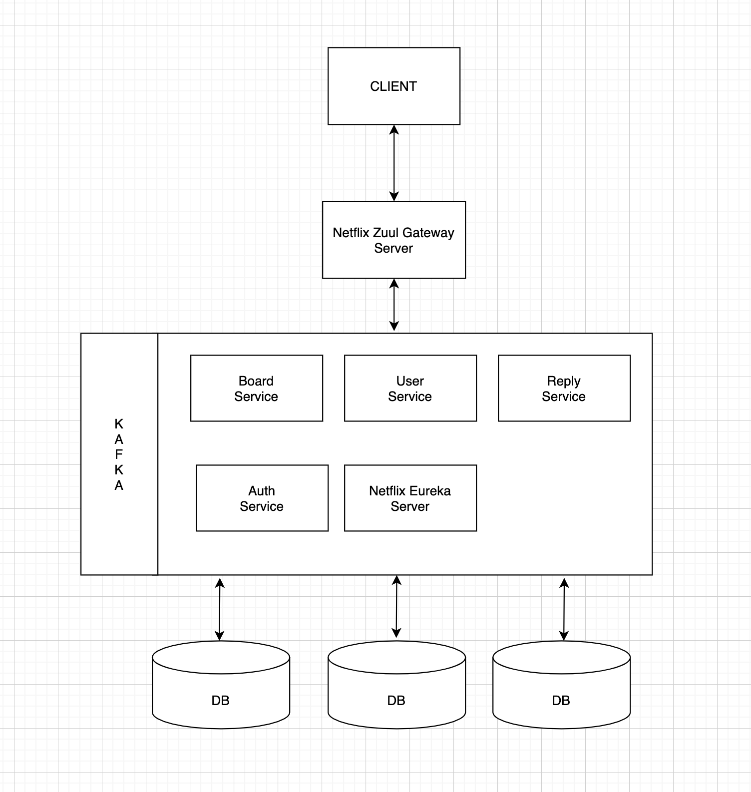

# Using MSA  and Reactor, non-blocking board project

## 기술 스택

- SpringBoot

- R2DBC

- Reactor

- Kafka

- ELK

- Docker

  

## 목표

- 마이크로 서비스 아키텍처를 이용하여 게시판을 만들어보며 스프링 클라우드에 대한 이해도 높이기.
- Reactive 프로그래밍에 익숙해지기

## 예상 구현도

- Board Service : 게시판에 관련된 서비스
- User Service : 유저 관리의 관련된 서비스
- Reply Service : 게시판 댓글에 관련된 서비스
- Auth Service : 유저 인증에 관련된 서비스
- Eureka Server : 클라우드에 배포된 서비스들의 목록 리스트를 갖고 있는 서버
- Zuul Server : 여러 개의 서비스에 대한 엔드포인트를 하나로 합쳐주는 서버

각각의 서버는 자기 도메인에 기능에 대한 책임만을 갖고 있으며, 독자적으로 실행이 가능하다. 마이크로 서비스는 서로 통신을 하며, 필요한 데이터를 주고 받을 수 있다.

## 최종목표

클라우드에 실제로 배포하여, 쿠버네티스를 이용한 오케스트레이션과 자동화를 목표

## 👊 Service Names

- Discovery : discovery Service Using Netflix Eureka
- Zuul : gateway service Using Nefilx Zuul
- Auth : authentication Service Using Oauth2-Cloud , Spring-Security
- Board  : CRUD Board Service 

